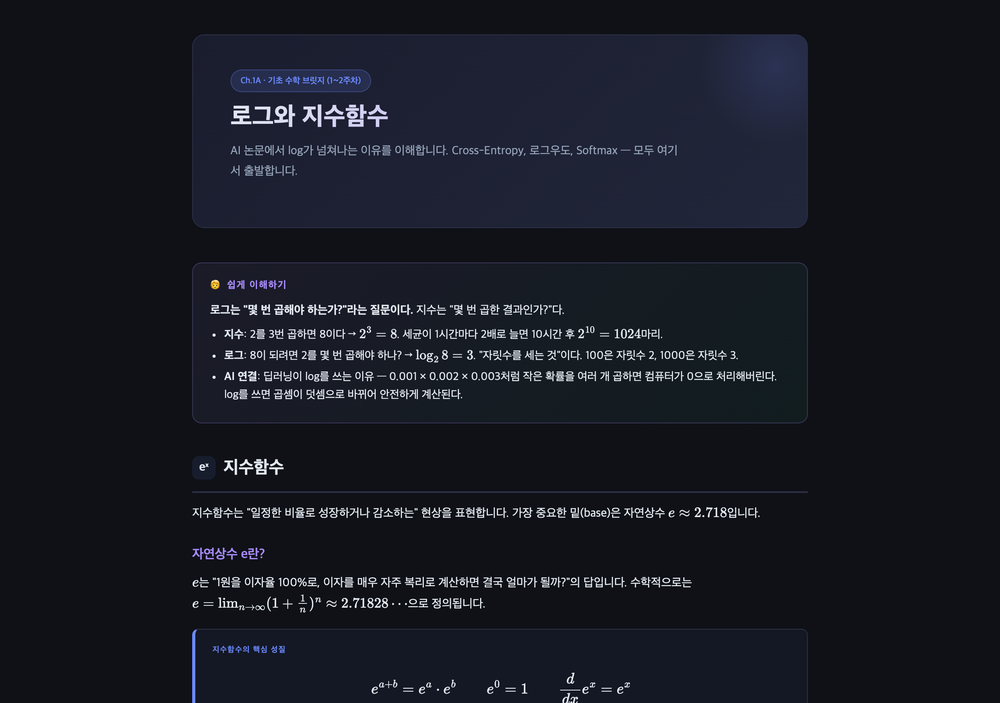
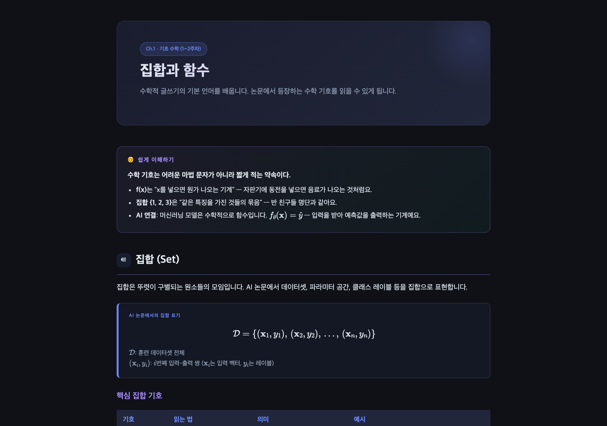
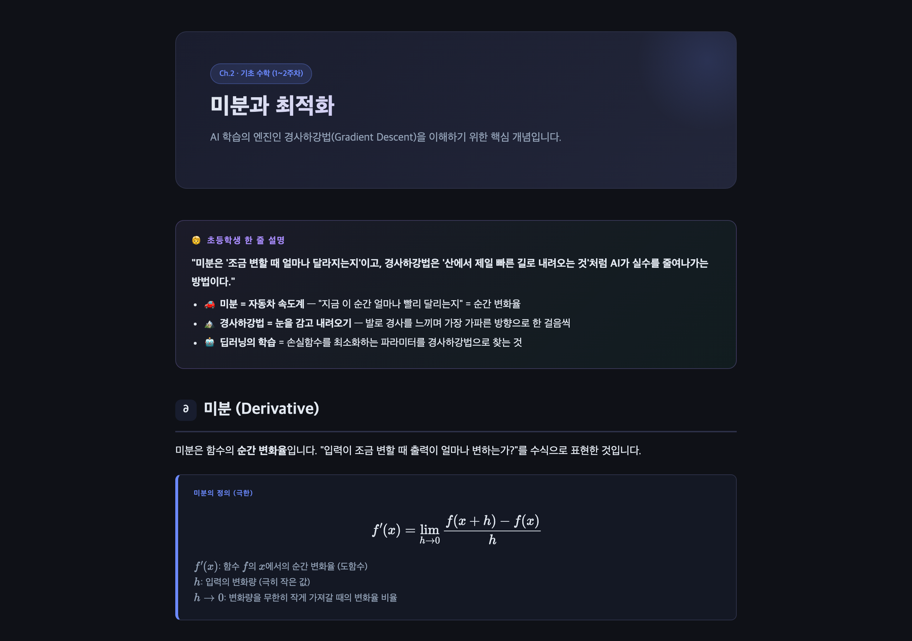
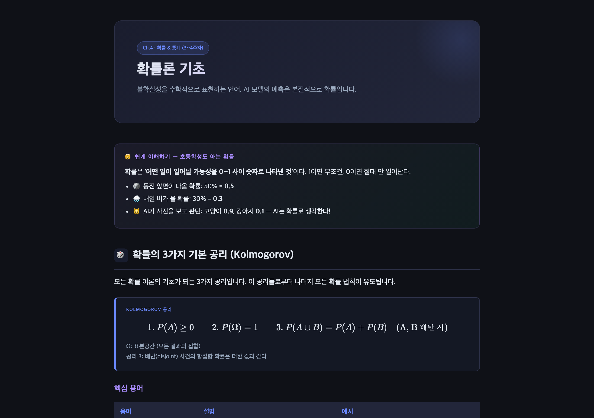
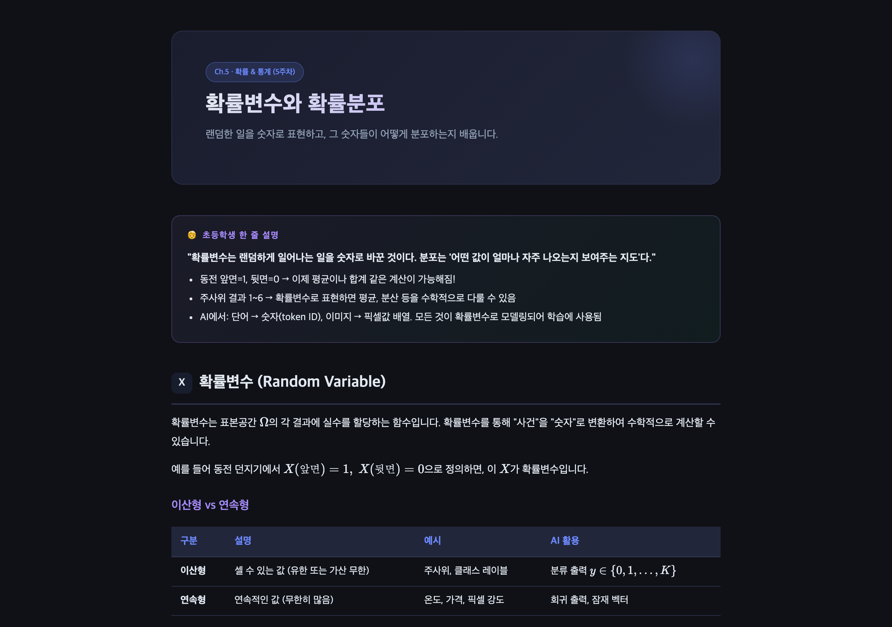
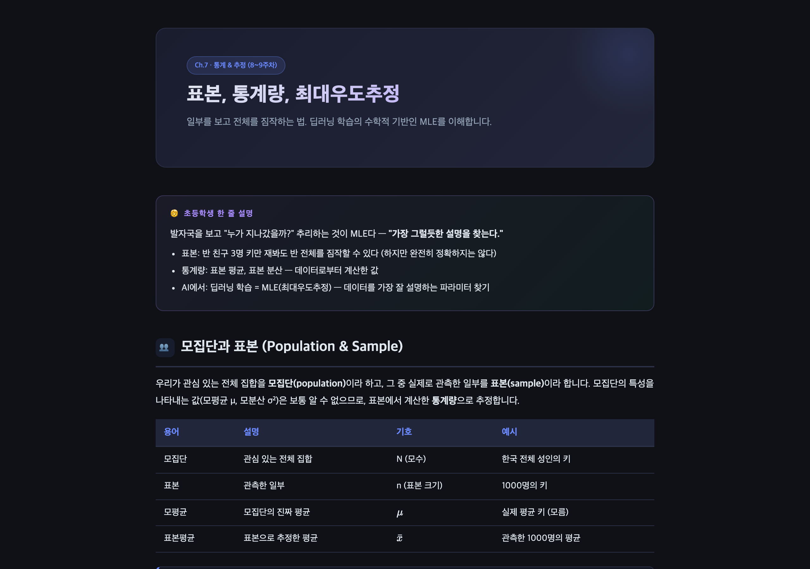
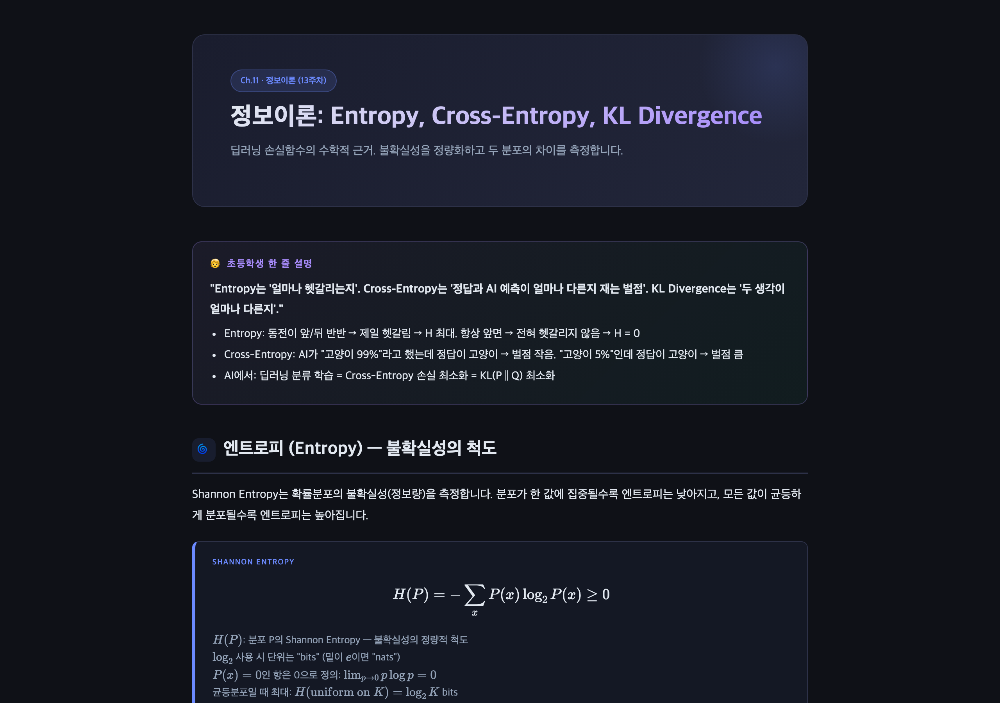
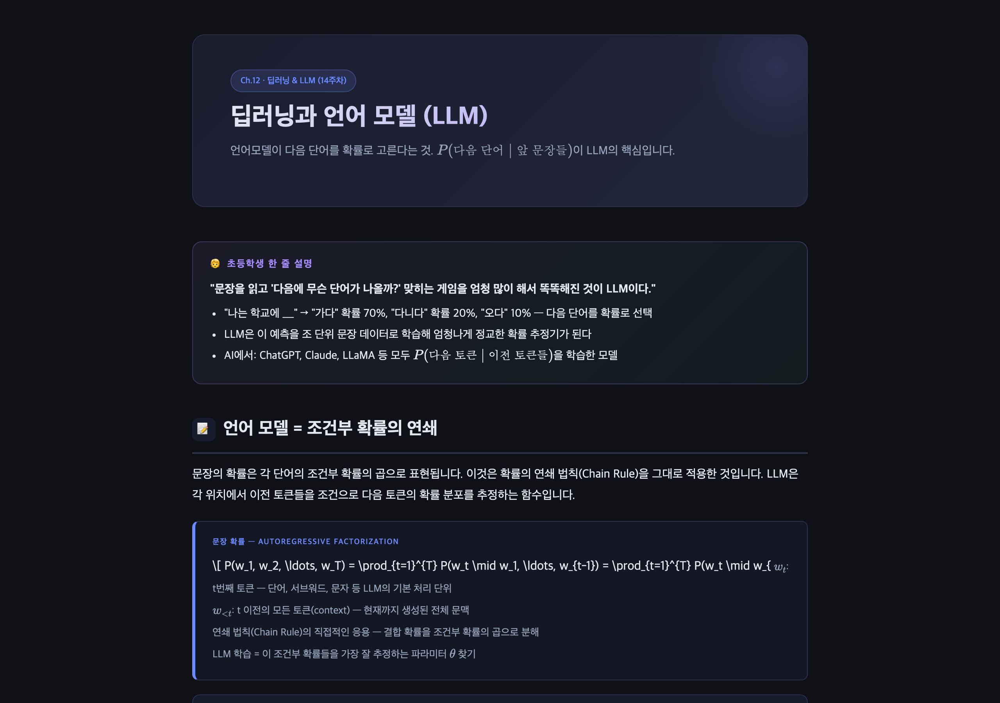

# 📐 논문을 위한 확률·수학·AI 인터랙티브 교재

> **"초등학생도 이해할 수 있는 비유 + 논문 수준의 수식"을 같은 페이지에서**

[](#phase-1--입문-브리지-18챕터)
[](#챕터-목록)
[](#qa-현황)
[](#라이선스)

---

## 미리보기

<table>
<tr>
<td width="50%">

<p align="center"><b>Ch.00A</b> 로그와 지수함수</p>
</td>
<td width="50%">

<p align="center"><b>Ch.01</b> 집합과 함수</p>
</td>
</tr>
<tr>
<td width="50%">

<p align="center"><b>Ch.02</b> 미분과 최적화 (경사하강법 시뮬레이터 포함)</p>
</td>
<td width="50%">

<p align="center"><b>Ch.04</b> 확률론 기초 & 베이즈 정리</p>
</td>
</tr>
<tr>
<td width="50%">

<p align="center"><b>Ch.05</b> 확률변수 & 확률분포</p>
</td>
<td width="50%">

<p align="center"><b>Ch.07</b> 표본 & 최대우도추정 (MLE)</p>
</td>
</tr>
<tr>
<td width="50%">

<p align="center"><b>Ch.11</b> 정보이론 (Entropy & KL Divergence)</p>
</td>
<td width="50%">

<p align="center"><b>Ch.12</b> 딥러닝 & LLM (Attention/Transformer)</p>
</td>
</tr>
</table>

---

## 개요

이 프로젝트는 **AI 논문을 읽고 쓰기 위해 필요한 기초 수학·확률·통계·정보이론**을 단계별로 익히는 인터랙티브 HTML 교재입니다.

수학 배경 없는 학습자가 SCI 국제학술지 논문을 스스로 읽고 쓰는 연구자로 성장하는 것을 최종 목표로 하며, 총 4개의 Phase에 걸쳐 약 50주(12개월) 커리큘럼으로 구성됩니다.

### 핵심 철학

모든 개념은 아래 **3개 층위**를 동시에 제공합니다:

| 층위 | 목표 독자 | 설명 방식 |
|------|-----------|-----------|
| **Layer 1** | 초등학생 | 일상 비유, 예시 리스트, 그림 언어 |
| **Layer 2** | 학부생 | 직관적 해설, 개념 카드, 표 |
| **Layer 3** | 대학원생/연구자 | 수학 공식 (MathJax), 논문 기호, AI 연결 |

---

## 대상 사용자

- 논문을 처음 쓰려는 대학원 입학 준비생
- AI/ML을 공부하지만 수학 배경이 부족한 개발자
- 확률·통계를 실무 AI와 연결하고 싶은 모든 학습자
- 수식을 이해하지 못한 채 딥러닝 코드만 쓰고 있는 엔지니어

---

## 전체 로드맵

```
Phase 1 │ 18챕터 │ 입문 브리지     → "논문 수식이 무섭지 않다"        ← 현재 진행중
Phase 2 │ 12주   │ 수학 심화       → "증명을 따라갈 수 있다"
Phase 3 │ 12주   │ ML 이론         → "논문 Contribution을 이해한다"
Phase 4 │  8주   │ 연구 실전       → "SCI 논문을 스스로 쓴다"
─────────────────────────────────────────────────────────────────
합계    │ 약 50주 │ 약 12개월
```

| Phase | 졸업 기준 | 읽을 수 있는 논문 수준 |
|-------|----------|----------------------|
| Phase 1 | NIPS/ICML 수식의 50% 이상 읽기 가능 | Distill.pub 아티클, 딥러닝 입문 |
| Phase 2 | NeurIPS Theorem 섹션 혼자 검증 가능 | "Attention is All You Need" 수식 절반 이상 |
| Phase 3 | 논문 Contribution을 수식 수준에서 비판 가능 | NeurIPS/ICML 메인 트랙 논문 대부분 |
| Phase 4 | SCI 논문 초고 완성, 리뷰어 역할 가능 | arXiv 제출 및 학술대회 투고 |

---

## Phase 1 — 입문 브리지 (18챕터)

### 챕터 목록

| 순서 | 파일 | 챕터명 | 핵심 개념 | 인터랙티브 | QA |
|------|------|--------|----------|:---------:|:--:|
| 0-A | `ch00a.html` | 로그와 지수함수 | log, e^x, 자연로그, AI 손실함수 연결 | — | 🏆 PASS |
| 0-B | `ch00b.html` | 수열과 Σ 표기 | 수열, Σ 표기, 평균·합 표현 | — | 🏆 PASS |
| 1 | `ch01.html` | 집합과 함수 | 집합 기호, f: X→Y, ∀, ∃ | — | 🏆 PASS |
| 2 | `ch02.html` | 미분과 최적화 | f'(x), 경사하강법, 학습률 | 경사하강법 시뮬레이터 | 🏆 PASS |
| 2-B | `ch02b.html` | 적분 기초 | 정적분, 기댓값과 적분 연결 | — | 🏆 PASS |
| 3 | `ch03.html` | 선형대수 기초 | 벡터, 행렬 곱, 내적 | — | 🏆 PASS |
| 3-B | `ch03b.html` | 선형회귀·최소제곱법 | OLS, 정규방정식, RSS | — | 🏆 PASS |
| 4 | `ch04.html` | 확률론·베이즈 | P(A\|B), prior/posterior | 베이즈 업데이터 | 🏆 PASS |
| 5 | `ch05.html` | 확률변수·분포 | 정규분포, 베르누이, 포아송 | 분포 계산기 | 🏆 PASS |
| 6 | `ch06.html` | 기대값·분산 | E[X], Var[X], 공분산 | 기대값 계산기 | 🏆 PASS |
| 7 | `ch07.html` | 표본·MLE | 최대우도추정, 표본분포 | MLE 시뮬레이터 | 🏆 PASS |
| 8 | `ch08.html` | MAP·Bias-Variance | 정규화, 과적합 | B-V 트레이드오프 시각화 | 🏆 PASS |
| 9 | `ch09.html` | ML연결1·Logistic | sigmoid, cross-entropy | sigmoid 계산기 | ❌ FAIL |
| 10 | `ch10.html` | ML연결2·Softmax | softmax, multinomial | softmax 계산기 | ❌ FAIL |
| 11 | `ch11.html` | 정보이론 | entropy, KL divergence | entropy 계산기 | 🏆 PASS |
| 12 | `ch12.html` | 딥러닝·LLM | attention, transformer | temperature 슬라이더 | 🏆 PASS |
| 13 | `ch13.html` | Calibration | ECE, temperature scaling | ECE 시각화 | 🏆 PASS |
| 14 | `ch14.html` | 논문읽기·쓰기 | 논문 구조, 기호 해독 | — | 🏆 PASS |

> **보강 챕터 추가 배경**: 원래 14주 계획에서 `ch00a`, `ch00b`, `ch02b`, `ch03b` 4개가 추가됨.  
> 로그·수열 없이는 MLE·Entropy 이해가 불가하고, 적분 없이는 연속 확률분포를 다룰 수 없기 때문.

---

## Phase 2 — 수학 심화 (개발 예정, 12주)

> **선행 조건**: Phase 1 전체 QA_PASS 완료

| 모듈 | 주제 | 핵심 내용 |
|------|------|----------|
| 2-A (3주) | 해석학 기초 | ε-δ 논증, Lipschitz 연속, Taylor 급수 |
| 2-B (3주) | 볼록 최적화 | Lagrangian, KKT 조건, 수렴 속도 분석 |
| 2-C (3주) | 측도 기반 확률론 | σ-대수, 확률변수 수렴, Lebesgue 적분 |
| 2-D (3주) | 선형대수 심화 | SVD, 고유값 분해, 행렬 미분 |

---

## Phase 3 — ML 이론 (개발 예정, 12주)

> **선행 조건**: Phase 2 전체 완료 / Stanford CS229·CS231n 수준

| 모듈 | 주제 | 핵심 내용 |
|------|------|----------|
| 3-A (3주) | 통계적 학습 이론 | PAC Learning, VC Dimension, Rademacher 복잡도 |
| 3-B (3주) | 고전 ML 이론 | Kernel Methods, 가우시안 프로세스, EM Algorithm |
| 3-C (3주) | 딥러닝 이론 | Universal Approximation, Loss Landscape, Transformer 이론 |
| 3-D (3주) | 확률 생성 모델 | VAE·ELBO, Normalizing Flow, Diffusion Models (DDPM) |

---

## Phase 4 — 연구 실전 (개발 예정, 8주)

> **선행 조건**: Phase 3 전체 완료

| 모듈 | 주제 | 실습 내용 |
|------|------|----------|
| 4-A (2주) | 논문 해부 | Abstract/Method/Experiment 섹션 역할 분석 |
| 4-B (2주) | 실험 설계 | Ablation Study, p-value, paired t-test |
| 4-C (3주) | 논문 쓰기 실전 | Related Work, Method 수식 설계, Introduction 구조 |
| 4-D (1주) | 리뷰어 관점 훈련 | OpenReview 분석, Rebuttal 작성 연습 |

---

## 프로젝트 구조

```
percent_ml/
├── index.html                    ← 메인 진입점 (사이드바 + 전체 챕터 통합)
├── chapters/                     ← 챕터별 독립 HTML
│   ├── ch00a.html                ← 로그와 지수함수
│   ├── ch00b.html                ← 수열과 Σ 표기
│   ├── ch01.html ~ ch14.html     ← 핵심 챕터 14개
│   └── ch02b.html, ch03b.html    ← 보강 챕터
└── docs/                         ← 개발 문서 (에이전트용)
    ├── PRD.md                    ← 전체 요구사항 명세
    ├── ROADMAP.md                ← Phase 1~4 전체 로드맵
    ├── DESIGN_SYSTEM.md          ← CSS/UI 컴포넌트 규칙
    ├── CHAPTER_TEMPLATE.md       ← 챕터 HTML 빈 템플릿
    ├── PROGRESS.md               ← 챕터별 개발 진행 상황
    ├── LOCKS.md                  ← 동시 작업 충돌 방지 락
    └── chapters/                 ← 챕터별 콘텐츠 명세
        ├── week01.md ~ week14.md
        └── week00a.md, week00b.md
```

---

## 챕터 구성 원칙

모든 챕터는 아래 **7개 필수 블록**을 순서대로 포함합니다:

```
[1] HERO          — 챕터 번호·카테고리·주차 뱃지 + 제목 + 학습 목적 한 줄
[2] EASY BOX      — 🧒 초등학생 비유 (일상 사례 + AI 연결)
[3] MAIN CONTENT  — 핵심 개념 설명 (직관 위주, 표/개념카드 포함)
[4] FORMULA BOX   — MathJax 수식 + 한국어 기호 주석 (.fn)
[5] INTERACTIVE   — 실시간 파라미터 조작 계산기·시뮬레이터
[6] QUIZ          — 4지선다 확인 문제 (즉시 피드백)
[7] NAV BUTTONS   — 이전/다음 챕터 이동 버튼
```

---

## 기술 스택

| 항목 | 선택 | 이유 |
|------|------|------|
| 마크업 | Vanilla HTML5 | 의존성 제로, 어디서나 열림 |
| 스타일 | CSS Variables (다크 테마) | 디자인 토큰 기반, 유지보수 용이 |
| 수식 렌더링 | [MathJax 3](https://www.mathjax.org/) | LaTeX 문법 그대로, 논문 수준 수식 |
| 인터랙티브 | Vanilla JavaScript | 빌드 없이 브라우저에서 즉시 실행 |
| 저장 | localStorage | 퀴즈 체크 상태 자동 저장 |

### 디자인 토큰 (색상)

```css
--bg:       #0f1117   /* 전체 배경          */
--surface:  #1a1d27   /* 사이드바 배경      */
--surface2: #22263a   /* 카드 배경          */
--accent:   #6c8aff   /* 주요 강조 (파란보라) */
--accent2:  #a78bfa   /* 소제목 (연보라)    */
--accent3:  #34d399   /* 정답·성공 (초록)   */
--accent4:  #f59e0b   /* 퀴즈·경고 (노랑)   */
--accent5:  #f87171   /* 오류 (빨강)        */
--text:     #e2e8f0   /* 본문 텍스트        */
--muted:    #94a3b8   /* 보조 텍스트        */
```

---

## 빠른 시작

별도 빌드 과정 없이 브라우저로 바로 열 수 있습니다.

```bash
# 저장소 클론
git clone https://github.com/quentinjeon/ai-master-degree-edu.git
cd ai-master-degree-edu

# 브라우저로 열기 (macOS)
open index.html

# 브라우저로 열기 (Linux)
xdg-open index.html

# 또는 로컬 서버 (Python 3)
python -m http.server 8080
# → http://localhost:8080 접속
```

> **권장 브라우저**: Chrome 120+ / Firefox 121+ / Safari 17+  
> MathJax 수식 렌더링에 JavaScript가 활성화되어 있어야 합니다.

---

## QA 현황

| 상태 | 챕터 수 | 파일 |
|------|--------|------|
| 🏆 QA_PASS | 16 | ch00a, ch00b, ch01~ch08, ch02b, ch03b, ch11~ch14 |
| ❌ QA_FAIL (수정 중) | 2 | ch09 (EASY BOX 수정 중), ch10 (EASY BOX 수정 중) |
| 🔜 개발 예정 | — | Phase 2~4 전체 |

Phase 1 통합 조건 (`index.html` 사이드바 통합):
- [ ] ch09, ch10 QA_PASS 완료
- [ ] 전체 챕터 NAV 링크 순서 재검토
- [ ] Integration Agent 실행

---

## 기여 방법

현재 이 프로젝트는 **개인 연구 학습 프로젝트**로 운영되고 있습니다.

오류 발견 및 제안 사항은 아래 연락처로 알려주세요.

---

## 개발자

| 항목 | 내용 |
|------|------|
| **이름** | 전용섭 (Jeon Yong-seop) |
| **소속** | 서울대학교 공학전문대학원 산업AI 트랙 |
| **이메일** | [zerotoanother@snu.ac.kr](mailto:zerotoanother@snu.ac.kr) |
| **GitHub** | [@quentinjeon](https://github.com/quentinjeon) |

---

## 라이선스

이 프로젝트는 [MIT License](LICENSE) 하에 공개됩니다.

교육 목적의 자유로운 활용을 환영합니다. 단, 출처 표기를 부탁드립니다.

---

<div align="center">

**수학 배경 제로 → SCI 논문 제출까지**  
*"이 코스를 들으면 Phase 2~4를 두려움 없이 시작할 수 있다"*

서울대학교 공학전문대학원 산업AI 트랙 | 전용섭

</div>
